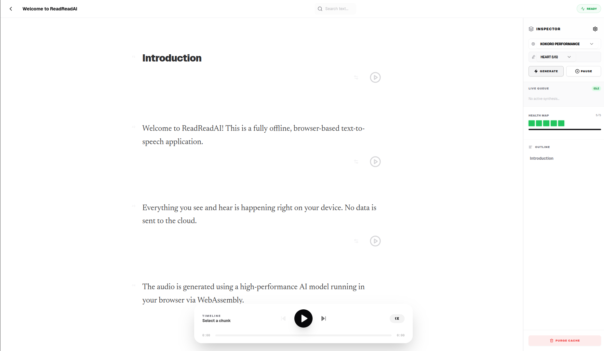
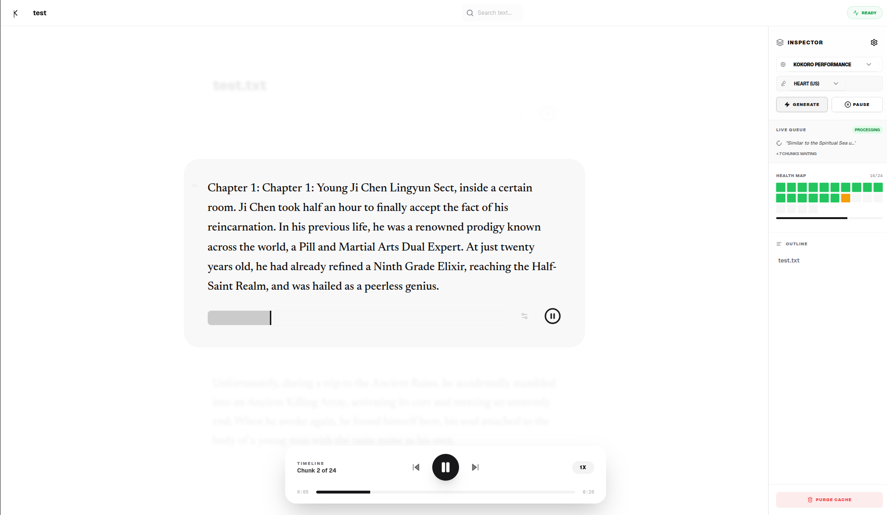

  

   
   

  <h1>🎧 ReadRead Studio</h1>
  
  
<strong>A 100% Local, Browser-Based AI Text-to-Speech Studio</strong>

  
  
  
  

---

## 📖 Overview

**ReadRead Studio** is a privacy-first, fully offline AI voice generation application. It allows users to import large documents (PDF, TXT, HTML) and synthesize high-fidelity, human-like audio directly on their device. 

**Zero cloud. Zero latency. Absolute privacy.** 

By leveraging WebAssembly (ONNX Runtime) and the Origin Private File System (OPFS), this Progressive Web App (PWA) brings desktop-class ML processing directly into the browser without requiring a backend server.

---

## ✨ Features & Showcase

* **On-Device Inference**: Runs models like Kokoro-82M locally using `onnxruntime-web`.
* **Massive Document Support**: Stream-processes 100+ page PDFs without freezing the UI.
* **Gapless Playback Engine**: Custom `AudioWorklet` for seamless, stutter-free PCM streaming.
* **Offline-First (PWA)**: Fully installable. Works entirely without an internet connection once cached.
* **Storage Quota Management**: Actively monitors hardware storage and orchestrates background garbage collection.

---

## 🛠 Tech Stack

I strongly believe in using industry standards and battle-tested libraries as the foundation to build complex systems.

* **Core**: React 19, TypeScript, Vite
* **State Management**: Zustand (UI State), XState (Job Queues & Orchestration)
* **AI / ML**: ONNX Runtime Web, Kokoro-js, espeak-ng (Compiled to WASM)
* **Data / Storage**: Dexie (IndexedDB for metadata), OPFS (Origin Private File System for raw audio blobs)
* **Multithreading**: Web Workers + Comlink (for UI unblocking), AudioWorklets
* **Styling / UI**: Tailwind CSS, Radix UI Primitives, Lucide Icons

---

## 🧠 Non-Trivial Engineering Challenges Solved

Building a desktop-grade ML application in the browser requires bypassing standard web limitations. Here are a few technical hurdles overcome in this project:

### 1. WebAssembly Memory Management & OOM Prevention
Running heavy 8-bit or FP16 quantized AI models in the browser is notoriously crash-prone due to WASM memory limits. 
* **Solution**: Implemented robust **Worker Tearing**. Heavy inferences are offloaded to dedicated Web Workers. Using a custom `WorkerFactory`, threads are aggressively torn down and recreated between heavy loads to force garbage collection and flush WASM memory contexts, completely preventing OOM (Out of Memory) crashes.

### 2. Gapless Audio Streaming via AudioWorklets
Standard `<audio>` tags introduce micro-stutters when transitioning between hundreds of generated audio chunks, ruining the listening experience.
* **Solution**: Bypassed the DOM audio API entirely. Engineered a custom `AudioWorkletProcessor` operating on a separate audio thread. It utilizes a ring-buffer to queue raw PCM float data directly from IndexedDB, ensuring zero-latency, gapless transitions and precise sample-level playback control.

### 3. Mass Data Ingestion without Main-Thread Blocking
Parsing a massive PDF and chunking it by semantics/prosody can lock the browser's main thread, triggering the "Page Unresponsive" warning.
* **Solution**: Built an iterative ingestion pipeline using Web Workers. PDFs are lazily parsed page-by-page. Text is semantically chunked (via LangChain-inspired logic) and streamed into IndexedDB in bounded batches.

### 4. Resilient Job Orchestration
Synthesizing hundreds of paragraphs takes time. If the user closes the tab or the device runs out of storage, data could be corrupted.
* **Solution**: Designed a robust background job queue using **XState**. State machines handle prioritization, retry logic, and pausing/resuming based on hardware constraints (e.g., dynamically pausing the queue if the `StorageQuotaService` detects the device is 90% full).

### 5. File System Synchronization
Browsers struggle to store gigabytes of raw WAV data in standard IndexedDB.
* **Solution**: Bridged IndexedDB (fast metadata querying) with **OPFS** (high-performance physical file storage). Wrote a background Garbage Collector that utilizes `requestIdleCallback` to safely reconcile databases and purge orphaned audio blobs during browser idle time.

---

## 🚀 Roadmap & Future Pivots

While currently focused on offline TTS, the architecture is designed to scale into a **Dynamic Content Generation Studio**:

* **[TODO] Multi-Model & API Support**: Kitten-TTS for lower end devices. Integrate external cloud providers (OpenAI, ElevenLabs) for users who prefer cloud-quality voices alongside local models.
* **[TODO] LLM-Based "Smart Chunking"**: Integrate local LLMs (e.g., WebLLM) to intelligently rewrite, summarize, or adjust the prosody of text prior to TTS synthesis.
* **[TODO] Dynamic Media Generation**: Pivot toward video/image generation, allowing the studio to pair synthesized voices with dynamic visuals (generating faceless videos, automated presentations, or podcasts).
* **[TODO] Advanced Audio Editor**: Introduce waveform editing, pitch-shifting, and multi-track layering within the canvas.